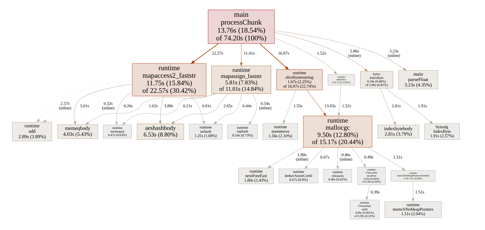
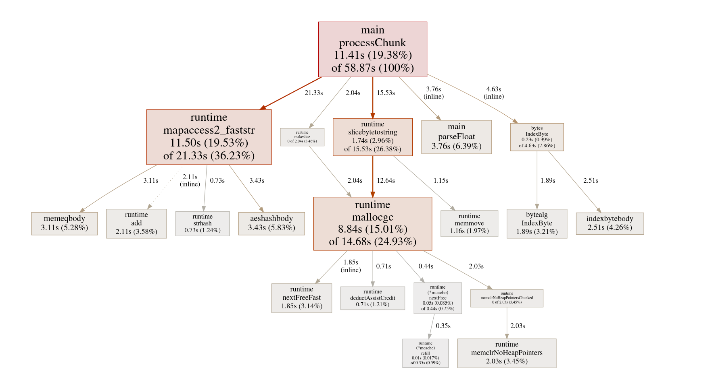
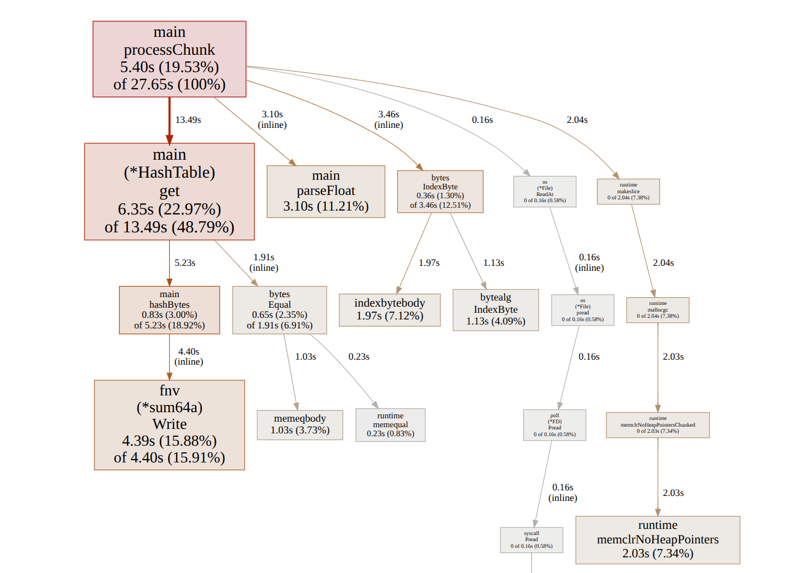

# 1brc.go
My attempt for the [1 Billion Row Challenge](https://github.com/gunnarmorling/1brc) in Go

## 1st Iteration
- Single thread, naive approach
```
________________________________________________________
Executed in   73.42 secs    fish           external
   usr time   71.72 secs    0.00 micros   71.72 secs
   sys time    2.92 secs  476.00 micros    2.92 secs
```

## 2nd Iteration
- Change `scanner.Text()` to `scanner.Bytes()`
- Replace `ParseFloat()` with manual parsing
```
________________________________________________________
Executed in   62.57 secs    fish           external
   usr time   60.67 secs    0.00 micros   60.67 secs
   sys time    2.63 secs  434.00 micros    2.63 secs
```

## 3rd Iteration
- Divide file into chunks and process concurrently with goroutines
```
________________________________________________________
Executed in   36.73 secs    fish           external
   usr time   69.42 secs  427.00 micros   69.42 secs
   sys time   12.06 secs    0.00 micros   12.06 secs
```


At this point I was stuck on how to further optimize and turned to profiling. The results indicated that `mapaccess2_faststr` was the primary bottleneck (this is the function for map lookups with the `comma, ok` check), followed by memory allocation `mallocgc`. With no obvious optimization strategy coming to mind, I decided to procrastinate and tackle the third candidate first, `mapassign_faststr`.

In the current implementation, the map stores `Data` structs by value. Every time the map needs to be updated, the code retrieves the existing value from the map, constructs a new `Data` struct and writes it back into the map. This means that every update results in a map assignment. To reduce the cost of these repeated assignments, I changed the map to store pointers to `Data` instead. In this way, assignment only happens once when a key is inserted, subsequent updates mutate the `Data` struct in place via the pointer.

## 4th Iteration
- Store pointers to `Data` struct as map value
```
________________________________________________________
Executed in   34.28 secs    fish           external
   usr time   53.75 secs  346.00 micros   53.75 secs
   sys time   11.85 secs    0.00 micros   11.85 secs
```


As a result, `mapassign_faststr` effectively disappeared in the graph. The improvement in execution time is marginal, since the optimization basically reduces the number of map writes at the cost of additional pointer dereferencing.

A large portion of run time is attributed to `mallocgc`, the major caller of which is `slicebytetostring`. This is frequently invoked because a station name needs to be converted from `[]byte` to `string` so it can be used as a key in Go's built-in map. The conversion happens once per line, resulting in many short-lived string allocations.

To eliminate the memory allocation overhead, I implemented a custom hash table that supports `[]byte` as key type. The table uses FNV-1a for hashing and linear probing for collision resolution. Each unique key is copied once into memory on first insertion, all subsequent lookups and updates operate directly on byte slices. This brings the total runtime down to ~16s.

P.S. To determine the size of hash table, I checked the number of unique stations in the input data:
```sh
> cut -d';' -f1 measurements.txt | sort -u | wc -l
413
```

## 5th Iteration
- Implement custom hash table where `[]byte` is used as keys
```
________________________________________________________
Executed in   16.21 secs    fish           external
   usr time   25.75 secs    0.00 micros   25.75 secs
   sys time    6.92 secs  504.00 micros    6.92 secs
```


## Takeaways
So this is what I end up with! I'm still very much a beginner in Go and this challenge pushed me far beyond what I expected when I first started. Here are the key takeaways I learned from attempting this challenge:
- When aiming for speed, functions and data structures tailored to a specific data format yield better performance than the standard library one built to be flexible and generic for everyone.
- Floating point parsing is expensive. `strconv.ParseFloat` handles many edge cases that are unnecessary for this dataset. Given the fixed data format in this challenge, parsing the bytes manually and converting the temperatures to scaled integers for arithmetic operations is far more efficient.
- While `bufio.Scanner` is easy to use, `scanner.Text()` allocates a new string for every single line and creates massive overhead for the GC. Low-level I/O like `Read` eliminates those allocations and offers more control over memory.
- Concurrency works best when work is decoupled. When trying to implement concurrency, my initial instinct was to use a shared map with a Mutex, but that creates a bottleneck, since only one goroutine gets to access the map, while all the others are forced to wait. Giving each goroutine its own isolated hash table via sharding allowed them to work independently without waiting on each other.
- Profiling is essential for identifying bottlenecks and pointing the way toward effective performance optimizations.
- Requesting memory in powers of two is more efficient than using round decimal numbers, because it aligns with OS's 4KB page size and allows complicated arithmetic operations to be replaced with faster bitwise instructions.
- Understanding what happens at a low level (I/O, memory allocation, GC, cache locality, pointer dereferencing, ...) is crucial for unlocking real performance gains.

## Further Optimisation Ideas
Although late to the party, I went to read some [nice](https://www.bytesizego.com/blog/one-billion-row-challenge-go) [writeups](https://benhoyt.com/writings/go-1brc/) about solving this challenge in Go and collected some ideas that can be further explored:
- Build a custom hashing algorithm instead of using the one provided by the library
- Inline the functions to eliminate the overhead of function calls
- Spawn the number of goroutines based on the number of CPU cores (`runtime.NumCPU()`) to fully utilize the available resources
- Map the file into memory with `mmap` to bypass standard I/O streams for maximum read performance
